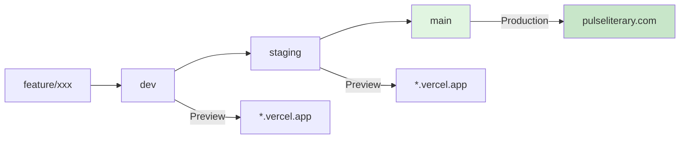

# Vercel Deployment Workflow - Pulse-Mag

> **Rule**: Never push to production without verifying preview builds first.

---

## Quick Reference Card

| What | Command/URL |
|------|---------------|
| **Dev → Staging** | `git checkout staging && git merge dev && git push` |
| **Staging → Production** | `git checkout main && git merge staging && git push` |
| **Emergency Hotfix** | Branch from `main`, fix, merge to `main`, then backport to `staging` & `dev` |
| **Rollback** | Vercel Dashboard → Deployments → "Promote to Production" on last good deploy |
| **Check Logs** | `vercel logs pulseliterary.com` |
| **Staging URL** | Check Vercel Dashboard → Deployments (random *.vercel.app) |

**Branches**: `dev` (preview) → `staging` (preview) → `main` (production)

---

## Branch Strategy

| Branch | Environment | URL | Purpose |
|--------|-------------|-----|---------|
| `dev` | Development Preview | `*.vercel.app` | Active development, experiments |
| `staging` | Staging Preview | `*.vercel.app` | Pre-release testing, QA |
| `main` | Production | `pulseliterary.com` | Live public site |

---

## Deployment Flow



**Never skip staging!** Always verify on staging before promoting to main.

---

## Step-by-Step Deployment Process

### 1. Development Work

```bash
# Start new feature
git checkout dev
git pull origin dev
git checkout -b feature/description

# Work on feature...
# Commit with conventional format:
git commit -m "feat(events): add Sanity-powered events page"

# Push and create PR to dev
git push origin feature/description
```

**Verification Checklist (dev branch):**
- [ ] `pnpm type-check` passes
- [ ] `pnpm lint` has < 100 errors
- [ ] `pnpm build:web` succeeds locally
- [ ] Preview deployment on Vercel succeeds

---

### 2. Promote to Staging

When dev branch is stable and tested:

```bash
# Merge feature to dev first (if on feature branch)
git checkout dev
git merge feature/description
git push origin dev

# Verify dev preview build, then:
git checkout staging
git pull origin staging
git merge dev
git push origin staging
```

**Staging Verification (MANDATORY):**
- [ ] Vercel staging preview builds successfully
- [ ] All pages render without errors:
  - [ ] Home `/`
  - [ ] Blog `/blog`
  - [ ] Blog posts `/blog/[slug]`
  - [ ] Events `/events`
  - [ ] Issues `/issues`
  - [ ] About `/about`
  - [ ] Submit `/submit`
  - [ ] Join `/join`
- [ ] No console errors in browser
- [ ] Mobile responsiveness OK
- [ ] Sanity content loads correctly

**Staging URL**: Check Vercel Dashboard → Deployments for the preview URL

---

### 3. Promote to Production

**ONLY after staging passes all checks:**

```bash
git checkout main
git pull origin main
git merge staging

# Final verification
git log --oneline -3  # Should show staging commits

# Deploy to production
git push origin main
```

**Production Verification:**
- [ ] Vercel production build succeeds
- [ ] `pulseliterary.com` loads correctly
- [ ] Check Vercel deployment logs for errors
- [ ] Smoke test critical paths

---

## Emergency Hotfix Procedure

**If production is broken:**

```bash
# Create hotfix from main (not dev/staging)
git checkout main
git checkout -b hotfix/description

# Fix the issue
git commit -m "fix: resolve critical issue"
git push origin hotfix/description

# Fast-track to production (emergency only)
git checkout main
git merge hotfix/description
git push origin main

# Then merge back to staging and dev
git checkout staging
git merge hotfix/description
git push origin staging

git checkout dev
git merge hotfix/description
git push origin dev
```

**Hotfix Rules:**
- Only for critical bugs affecting users
- Minimal changes - fix one thing
- Must be tested locally before pushing
- Document the hotfix immediately after

---

## Vercel Configuration

### Build Settings
- **Framework Preset**: Next.js
- **Build Command**: `pnpm build`
- **Install Command**: `pnpm install --frozen-lockfile`
- **Output Directory**: `.next`

### Environment Variables
Set in Vercel Dashboard → Project → Settings → Environment Variables:

| Variable | Production | Preview | Development |
|----------|------------|---------|-------------|
| `NEXT_PUBLIC_SITE_URL` | `https://pulseliterary.com` | `https://*.vercel.app` | `http://localhost:3000` |
| `NEXT_PUBLIC_SANITY_PROJECT_ID` | ✓ | ✓ | ✓ |
| `NEXT_PUBLIC_SANITY_DATASET` | `production` | `production` | `production` |
| `SANITY_API_READ_TOKEN` | ✓ | ✓ | ✓ |
| `SANITY_PREVIEW_SECRET` | ✓ | ✓ | ✓ |

---

## Pre-Deployment Checklist

### Before Any Push to `main`:

1. **Code Quality**
   - [ ] TypeScript passes: `pnpm type-check`
   - [ ] No critical lint errors
   - [ ] No `console.log` in production code (except errors)

2. **Build Verification**
   - [ ] `pnpm build:web` succeeds locally
   - [ ] No build warnings that could cause failures

3. **Content Verification**
   - [ ] Sanity client configured correctly
   - [ ] Environment variables set in Vercel

4. **Staging Verified**
   - [ ] Staging preview URL tested
   - [ ] All critical paths working

---

## Rollback Procedure

**If production deployment breaks:**

1. **Immediate**: Go to Vercel Dashboard → Deployments
2. Find the last working deployment
3. Click "Promote to Production" on that deployment
4. This is instant - no rebuild needed

**Then fix forward:**
1. Create hotfix branch from `main`
2. Fix the issue
3. Deploy via hotfix procedure above

---

## Troubleshooting

| Symptom | Cause | Fix |
|---------|-------|-----|
| Build fails on Vercel | Missing pnpm-lock.yaml | `git add pnpm-lock.yaml && git commit` |
| TypeScript errors | Stale .next cache | `rm -rf .next apps/web/.next` |
| Sanity content 404 | Missing env var | Check `SANITY_API_READ_TOKEN` in Vercel |
| Images not loading | Image optimization | Currently disabled (enable after next deploy) |
| "Command not found" | Wrong Node version | Verify `engines.node >= 20.x` in package.json |

## Emergency Contacts
- **Vercel Dashboard**: https://vercel.com/dashboard
- **Sanity Studio**: Check your Sanity project URL
- **Domain DNS**: Check pulseliterary.com DNS settings

---

---

## Useful Commands

```bash
# Check Vercel deployment status
vercel --version

# View production logs
vercel logs pulseliterary.com

# Open production deployment
vercel open

# Check what will be deployed
git log dev..staging --oneline  # What's in staging not dev
git log staging..main --oneline  # What's in main not staging
```
